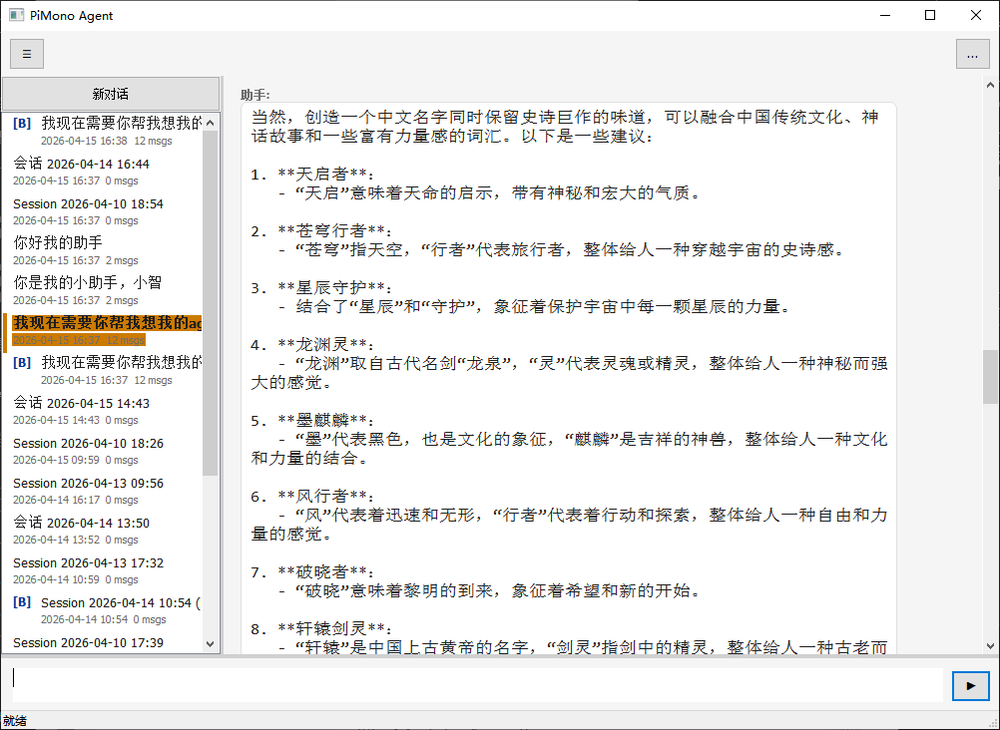
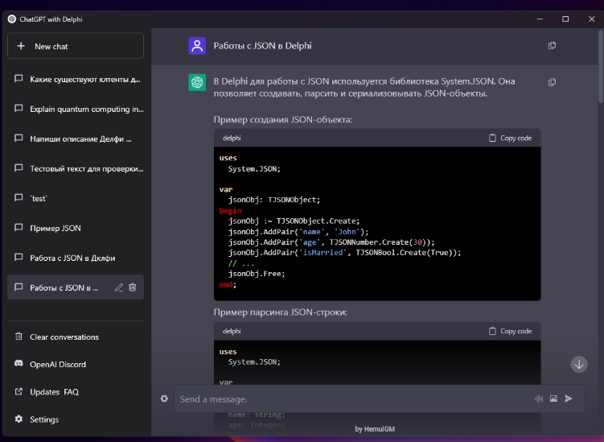
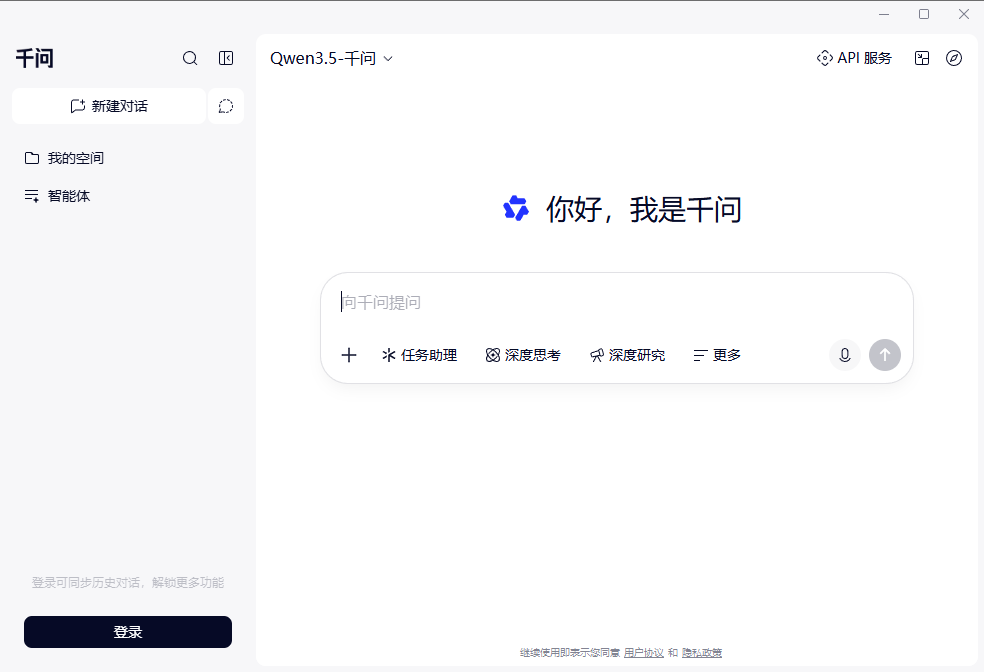

<h1 align="center">PiMono Agent</h1>

<p align="center">
  <strong>A desktop AI coding assistant built with Delphi + WebView2</strong>
</p>

<p align="center">
  
</p>

<p align="center">
  <a href="#features">Features</a> •
  <a href="#getting-started">Getting Started</a> •
  <a href="#architecture">Architecture</a> •
  <a href="#tech-stack">Tech Stack</a> •
  <a href="#license">License</a>
</p>

---

## What is PiMono Agent?

PiMono Agent is a native Windows desktop application that connects to OpenAI-compatible LLM APIs and provides an interactive AI coding assistant experience. It features a modern WebView2-based chat UI, a state-machine-driven agent loop with tool calling, and a rich set of built-in tools for file operations, shell commands, Git, and web search.

<p align="center">
  
  
</p>

## Features

### Agent Engine
- **State-machine driven agent loop** — automatically iterates between reasoning and tool calls until task completion
- **SSE streaming** — real-time token-by-token response rendering (~30fps throttled)
- **Tool calling** — structured JSON tool use with confirmation dialogs for destructive operations
- **MaxTurns limit** — prevents infinite agent loops
- **Thinking/extended thinking support** — configurable reasoning depth levels

### Built-in Tools
| Tool | Description |
|------|-------------|
| **File Read/Write/Edit** | Read, create, and edit files with three-tier fuzzy matching |
| **File Search** | `ls` directory listing, `find` by name pattern, `grep` content search |
| **Bash** | Execute shell commands with real-time output streaming |
| **Git** | `status`, `diff`, `log`, `blame`, `show`, `commit` operations |
| **Web Search** | Multi-provider search (Google, DuckDuckGo, Brave, SearXNG, Tavily, etc.) |

### Session Management
- Create, load, rename, delete, and export sessions
- **Session branching** — fork a conversation from any point
- **Session popup** — open a session in a separate window
- Auto-save with configurable intervals

### Context Management
- **Tool Result Slimming** — automatically compresses large tool outputs
- **LLM-powered compaction** — summarizes older messages when context overflows
- **Emergency truncation** — hard cutoff when context exceeds model limits
- **Token estimation** — real-time context window usage tracking

### UI / UX
- **WebView2 chat interface** — modern HTML/CSS/JS UI with smooth animations
- **Markdown rendering** — full support for headings, bold, italic, code blocks, tables, links
- **Syntax-highlighted code blocks** — language detection, one-click copy
- **Theme system** — multiple built-in themes (cyberpunk-neon, light, dark, etc.)
- **Onboarding wizard** — guided first-run setup for API configuration
- **Session sidebar** — searchable session list with context menu
- **Settings panel** — configure models, tools, permissions, search providers

### Configuration
- **Multi-model profiles** — configure multiple LLM endpoints with different parameters
- **Tool permissions** — granular control over file access paths, command execution, confirmation requirements
- **Skill/Prompt templates** — reusable prompt templates with references and examples
- **Search provider configuration** — API keys, max results, fetch options per provider

### Other
- **Undo log** — all file write/edit operations are reversible (Ctrl+Z)
- **Localization framework** — bilingual UI (Chinese/English)
- **Structured logging** — configurable log levels with file rotation

## Getting Started

### Prerequisites

- **Delphi 11.x Alexandria** (or later)
- **Microsoft Edge WebView2 Runtime** ([download](https://developer.microsoft.com/en-us/microsoft-edge/webview2/))
- **WebView4Delphi** library (included in `_WebView4Delphi/`)
- An **OpenAI-compatible API endpoint** (OpenAI, Azure OpenAI, local LLM, etc.)

### Build

1. Clone the repository:
   ```bash
   git clone https://github.com/YOUR_USERNAME/PiMonoDelphi.git
   cd PiMonoDelphi
   ```

2. Open `PiMono.dproj` in Delphi IDE

3. Ensure WebView4Delphi library paths are correctly configured. The `_WebView4Delphi` directory contains the library source.

4. Build and run

### First Run

On first launch, the onboarding wizard will guide you through:
1. Setting your API endpoint URL (e.g., `https://api.openai.com/v1`)
2. Entering your API key
3. Selecting a model name (e.g., `gpt-4o`, `claude-sonnet-4-20250514`)
4. Configuring your working directory

Alternatively, manually edit `PiMono.json` in the application directory:

```json
{
  "Api": {
    "Endpoint": "https://api.openai.com/v1",
    "ApiKey": "sk-...",
    "Timeout": 120,
    "EnableStreaming": true
  },
  "Model": {
    "Name": "gpt-4o",
    "MaxTokens": 4096,
    "Temperature": 0.7
  },
  "Directories": {
    "Working": "C:\\Projects\\MyProject"
  }
}
```

## Architecture

```
PiMonoDelphi/
├── AI/                         # LLM API layer
│   ├── AI.IModel.pas           # Model interface (IAgentModel)
│   ├── AI.CustomAPIAdapter.pas # OpenAI-compatible API adapter (SSE streaming)
│   └── AI.ModelConfig.pas      # Model configuration types
├── Core/                       # Agent engine
│   ├── Core.Agent.pas          # Agent loop (state machine, tool dispatch)
│   ├── Core.AgentState.pas     # Agent state definitions
│   ├── Core.AgentFactory.pas   # Agent factory
│   ├── Core.Messages.pas       # Message types (TContentBlock, TChatMessage)
│   ├── Core.Events.pas         # Event system (streaming, tool calls, state changes)
│   ├── Core.SessionManager.pas # Session CRUD, branching, export
│   ├── Core.Compaction.pas     # Context compaction (LLM summarization)
│   ├── Core.ToolResultSlim.pas # Tool result compression
│   ├── Core.UndoLog.pas        # File operation undo system
│   └── App.Main.pas            # Application bootstrap & DI wiring
├── Tools/                      # Built-in tools
│   ├── Tools.ITool.pas         # Tool interface & base class
│   ├── Tools.ToolRegistry.pas  # Tool registration & lookup
│   ├── Tools.FileTools.pas     # File read/write/edit/ls/find/grep
│   ├── Tools.BashTool.pas      # Shell command execution
│   ├── Tools.GitTool.pas       # Git operations
│   ├── Tools.WebSearchTool.pas # Multi-provider web search
│   └── Tools.CommandRunner.pas # Async process runner
├── Settings/                   # Configuration
│   ├── Settings.Config.pas     # Config type definitions & serialization
│   ├── Settings.SettingsManager.pas # Config load/save/validate
│   └── Settings.SkillStore.pas # Prompt template management
├── UI/                         # Delphi VCL forms
│   ├── UI.MainForm.pas         # Main window (WebView2 host)
│   ├── UI.WebViewBridge.pas    # WebView2 ↔ Delphi bridge
│   ├── UI.SessionChatForm.pas  # Popout session window
│   └── UI.ThemeManager.pas     # Theme management
├── WebUI/                      # WebView2 frontend
│   ├── index.html              # Main HTML
│   ├── js/app.js               # Application controller
│   ├── js/bridge.js            # JS↔Delphi bridge layer
│   ├── js/chat.js              # Chat rendering engine
│   ├── js/sidebar.js           # Session sidebar
│   ├── js/settings.js          # Settings panel
│   ├── js/onboarding.js        # First-run wizard
│   ├── js/theme.js             # Theme engine
│   ├── css/styles.css          # Base styles
│   └── css/themes.css          # Theme definitions
├── Utils/                      # Utilities
│   ├── Utils.JsonHelper.pas    # JSON parsing helpers
│   ├── Utils.Markdown.pas      # Markdown processor
│   ├── Utils.Logger.pas        # Logging framework
│   ├── Utils.TokenEstimator.pas # Token counting estimation
│   └── Utils.Localization.pas  # i18n support
├── Tests/                      # Test suite
│   ├── AI/                     # AI layer tests
│   ├── Core/                   # Core engine tests
│   ├── Settings/               # Settings tests
│   ├── HGM/                    # UI utility tests
│   └── Mocks/                  # Test mocks
├── HGM/                        # Custom UI components (VCL)
├── _WebView4Delphi/            # WebView4Delphi library
├── docs/                       # Documentation (Chinese)
└── img/                        # Screenshots & assets
```

### Data Flow

```
User Input → WebView2 (JS) → WebViewBridge → Core.Agent → LLM API (SSE)
                    ↑                              ↓
              Chat Renderer ← Events ← Tool Execution ← Tool Result
```

1. User types a message in the WebView2 chat interface
2. JavaScript `bridge.js` serializes and sends to Delphi via `WebViewBridge`
3. `Core.Agent` appends the message and starts the agent loop
4. Agent calls the LLM API via `AI.CustomAPIAdapter` with SSE streaming
5. Streaming tokens are forwarded as events back to the WebView2 UI
6. When the LLM requests a tool call, the agent dispatches to the appropriate tool
7. Tool results are appended and the loop continues until the LLM returns a final text response

## Tech Stack

| Component | Technology |
|-----------|-----------|
| **Language** | Object Pascal (Delphi 11.x) |
| **UI Framework** | VCL + WebView2 (Microsoft Edge) |
| **WebView Bridge** | WebView4Delphi |
| **Frontend** | HTML5 / CSS3 / Vanilla JavaScript |
| **Markdown** | marked.js + highlight.js |
| **HTTP/SSE** | THTTPClient (System.Net.HttpClient) |
| **JSON** | System.JSON (built-in) |
| **Testing** | Custom DUnit-like framework |

## Supported LLM Providers

PiMono uses an OpenAI-compatible API adapter, supporting any provider that implements the OpenAI chat completions API:

- OpenAI (GPT-4o, GPT-4, etc.)
- Anthropic (Claude) via compatible proxy
- Google Gemini via compatible endpoint
- Azure OpenAI Service
- Local LLMs (Ollama, vLLM, LM Studio, etc.)
- Any custom OpenAI-compatible endpoint

## Roadmap

- [ ] Multi-modal message support (image input)
- [ ] Clipboard image paste
- [ ] Token usage statistics & cost estimation
- [ ] MCP (Model Context Protocol) client support
- [ ] System tray & background running
- [ ] Prompt template library
- [ ] Drag-and-drop file sending
- [ ] RAG local knowledge base
- [ ] Auto-update mechanism
- [ ] Plugin/extension system

## License

This project is licensed under the MIT License — see the [LICENSE](LICENSE) file for details.

---

<p align="center">
  Built with Delphi & WebView2
</p>
